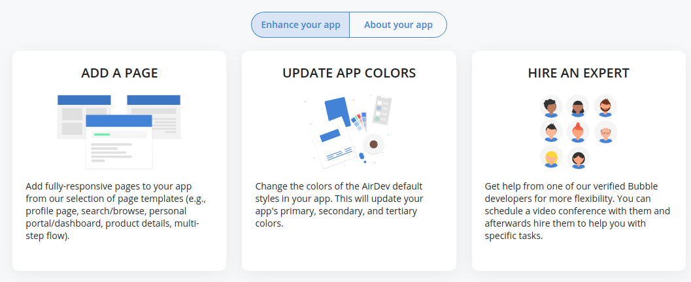
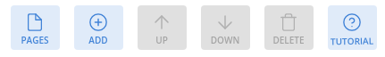
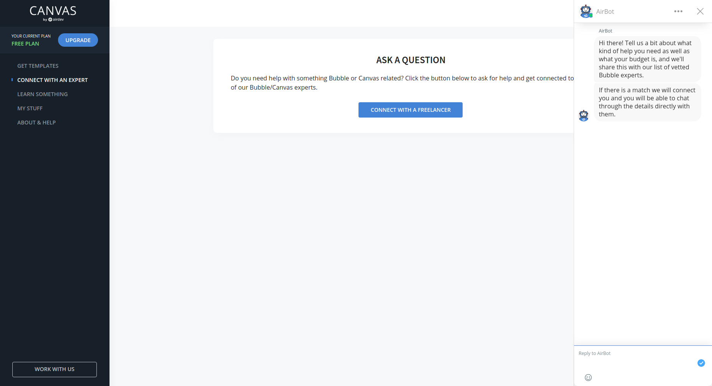
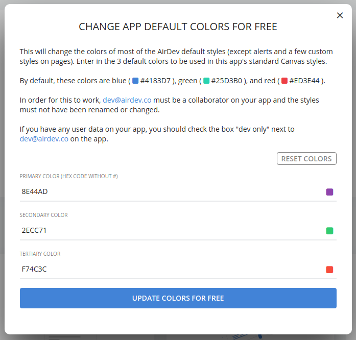

# How to Use Canvas \(detailed\)

### How to create a new app and add it to canvas

This guide is also available in a form with more images in the Practice using Canvas page of this documentation.

* [Sign up for Bubble](https://bubble.io) if you don't already have an account
* [Get an AirDev Canvas Template](https://bubble.io/template/canvas-starter-template-1541110863579x114287102114398200) for the creation of your new Bubble app
* Create a new Bubble app using the template
* Go to your app \(https://bubble.is/page?id=**YOURAPPNAME**\)
* Go to the _Settings tab_ &gt; _Collaboration tab_ &gt; add [dev@airdev.co](mailto:dev@airdev.co) as a collaborator and check the box for _Admin_
* Sign up for an account [on Canvas](https://canvas.airdev.co) using your Bubble email \(you'll need to use the same email address that you are using for your Bubble account\)
* [Go to _MY STUFF_ tab in Canvas Portal](https://canvas.airdev.co/index?tab=my%20stuff&sub=apps) to view all of your registered apps with Canvas Portal
* After your app is registered, you can click _VIEW DETAILS_ to add pages and modules.

### Link to Page Builder resources, already covered in intro and other places

\(TODO:\) Explain what the page builder is

To use the page builder, you must access it from [the Canvas dashboard](https://canvas.airdev.co/index?tab=my%20stuff&sub=apps). After selecting the app you'd like to modify, press "Add a Page" and follow the dialogue to be redirected to the Canvas Page Builder.

  
The first step is to add a page template from which your new page will be created. There are two free page templates and a growing number of premium ones.

When adding the template, you may be prompted to update your styles - if your app is newly created from the Canvas Template, this won't happen. A more detailed description is available below.‌

After your page has a template, you can either create the page \(by pressing Submit and following that dialogue\) or add groups to your page. These groups include functionality such as fully built Chat module \(complete with a database structure\), a YouTube video display group, dashboard-like repeating groups, and many more. [For a full list of available page templates and groups, see here.](https://docs.airdev.co/canvas-pages-and-modules/v/2.0.0/)

### Schedule a call with a Bubble Expert through Canvas

To schedule a call with a Bubble Expert, access the [_Connect with an Expert Tab_](https://canvas.airdev.co/index?tab=connect%20with%20an%20expert&sub=apps) in the Canvas dashboard.

### Explanation of how to update colors

One of the tools that comes with AirDev Canvas is the color updater. This updates the colors for all the Canvas styles included with your app. It can be found in the My Apps section of the Canvas Dashboard, the same place as the Page Updater and Hire an Expert buttons.

In order to use this tool, you'll need to select a primary, secondary and tertiary color you'd like to set up for your app. Colors are entered as "Hex Codes", and you can use [this site to find the hex code for a number of different colors](https://htmlcolorcodes.com/)., By default, the following colors are found in your app: 4183D7 \(blue\), 25D3B0 \(green\), and ED3E44 \(red\). Here is an example

### Explanation of how to update styles

TODO

