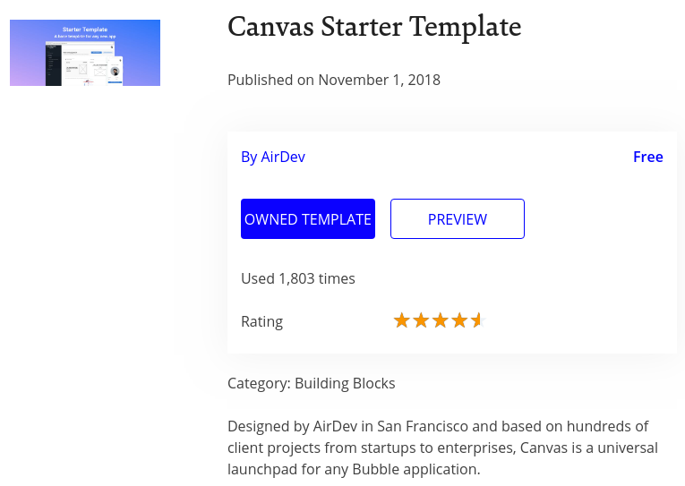
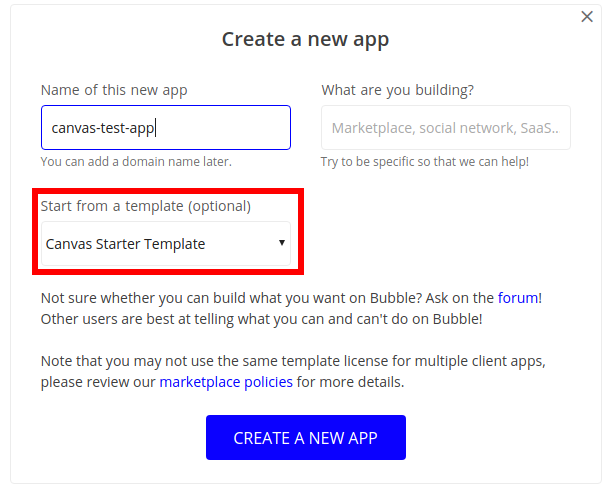
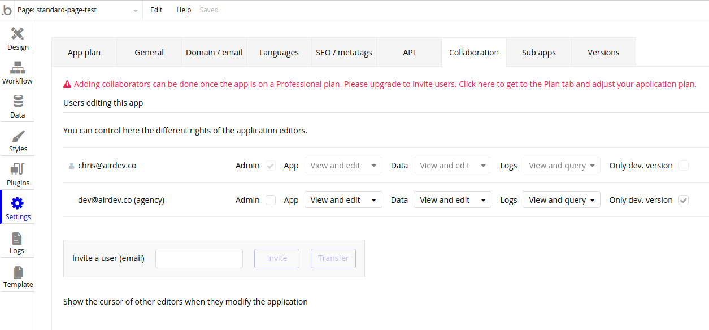
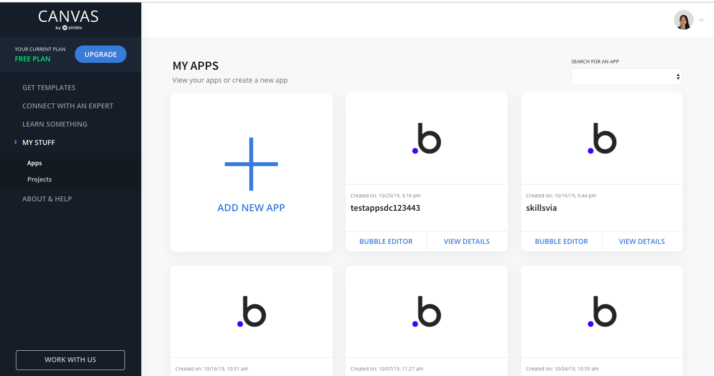
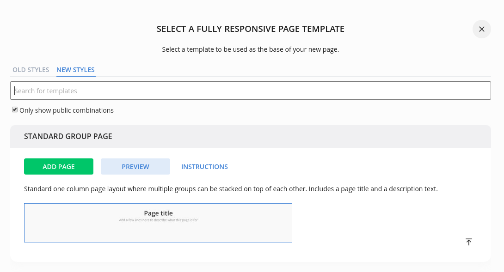
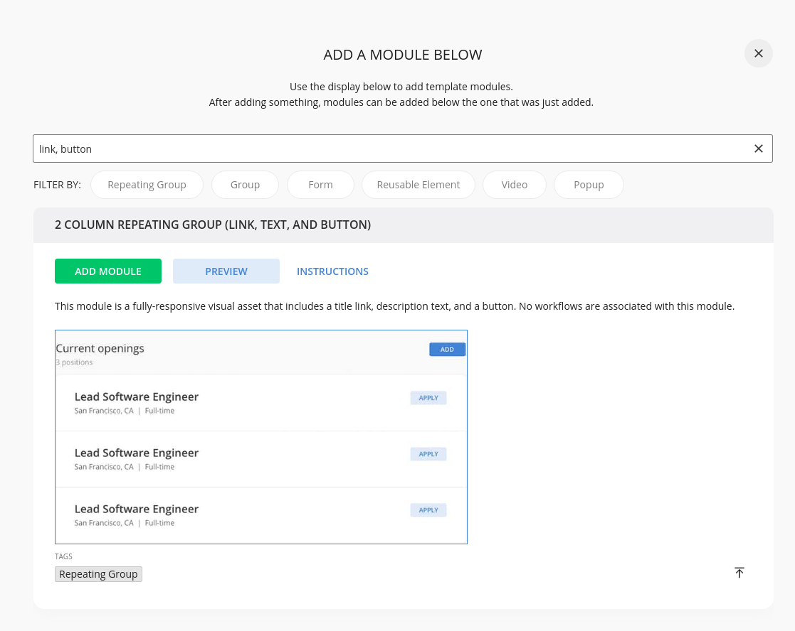
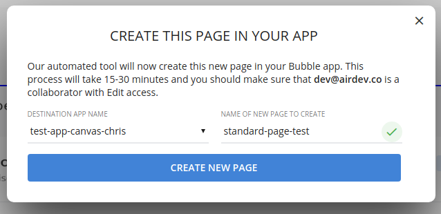
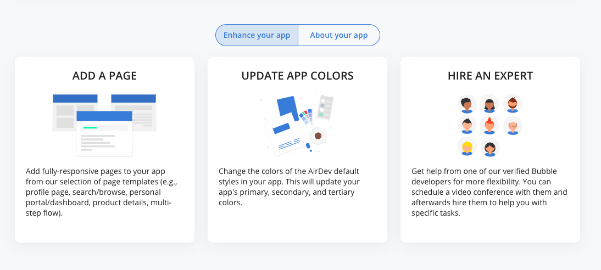
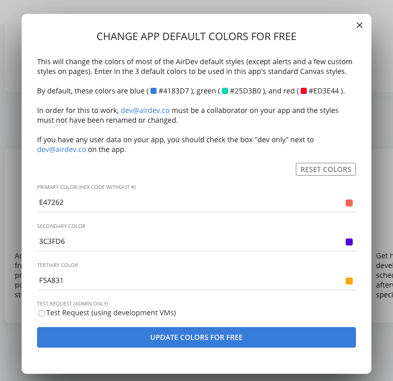

# Practice using Canvas

Ready to give this a try? Here's a set of steps you can follow, and then check your work with [this test page](https://airdev-canvas-tutorial.bubbleapps.io/version-test/standard-page-test) \([editor link](https://bubble.io/page?type=page&name=standard-page-test&id=airdev-canvas-tutorial&tab=tabs-1)\) we created for this exercise.

### Create new app and add to Canvas

Now, for a more detailed intro:

First, make sure that you have an [AirDev Canvas template ](https://bubble.io/template/canvas-starter-template-1541110863579x114287102114398200)to work from.

 

**Note: If you want to use Canvas to add pages, groups, or to change colors in your app, you will need to have dev@airdev.co added as a collaborator on your application.** Otherwise, it is impossible for us to add anything to your Bubble app.

You can remove dev@airdev.co after you're done adding groups with Canvas, but if you'd ever like to use Canvas' page and color tools, you'll need to add this account as a collaborator again. 

For a video tutorial of this process, see here \(TODO: edit and upload video\).

### Add new page through page builder

In the sample page that we've created for this tutorial, we used the Standard Page and added the 2 Column Repeating Group \(Link, Text, and Button\) to the app. 

#### Compare your page against our result

After completing your page, [compare it against our result](https://bubble.io/page?type=page&name=standard-page-test&id=airdev-canvas-tutorial&tab=tabs-1). Note that our app's colors may be different from yours.

### Update colors

In order to update an app's colors, you must select it from the Canvas dashboard.

Next, select some colors that you'd like to add. If you don't know what colors to add, you can use [this color palette random generator](https://coolors.co/app).

You'll receive an email when your app's colors have been changed. This should be in about 20-30 minutes.

